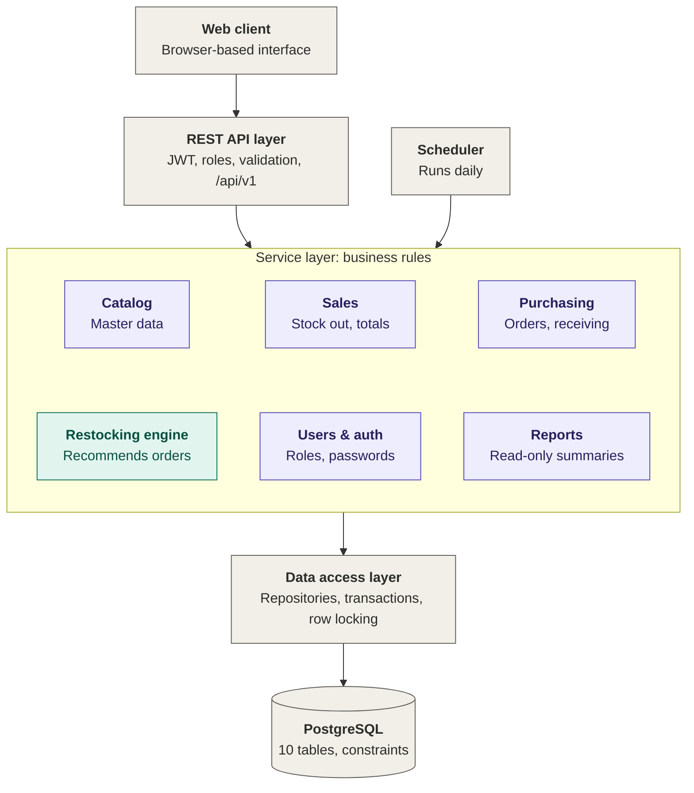

# System architecture 

```mermaid
flowchart TB
  client["<b>Web client</b><br/>Browser-based interface"]
  scheduler["<b>Scheduler</b><br/>Runs daily"]
  api["<b>REST API layer</b><br/>JWT, roles, validation, /api/v1"]

  subgraph services["Service layer: business rules"]
    direction TB
    catalog["<b>Catalog</b><br/>Master data"]
    sales["<b>Sales</b><br/>Stock out, totals"]
    purchasing["<b>Purchasing</b><br/>Orders, receiving"]
    engine["<b>Restocking engine</b><br/>Recommends orders"]
    users["<b>Users &amp; auth</b><br/>Roles, passwords"]
    reports["<b>Reports</b><br/>Read-only summaries"]
    catalog ~~~ engine
    sales ~~~ users
    purchasing ~~~ reports
  end

  dal["<b>Data access layer</b><br/>Repositories, transactions, row locking"]
  db[("<b>PostgreSQL</b><br/>10 tables, constraints")]

  client --> api
  api --> services
  scheduler --> services
  services --> dal
  dal --> db

  classDef restock fill:#E1F5EE,stroke:#0F6E56,color:#085041
  classDef service fill:#EEEDFE,stroke:#534AB7,color:#26215C
  classDef plain fill:#F1EFE8,stroke:#5F5E5A,color:#2C2C2A
  class engine restock
  class catalog,sales,purchasing,users,reports service
  class client,scheduler,api,dal,db plain
```
