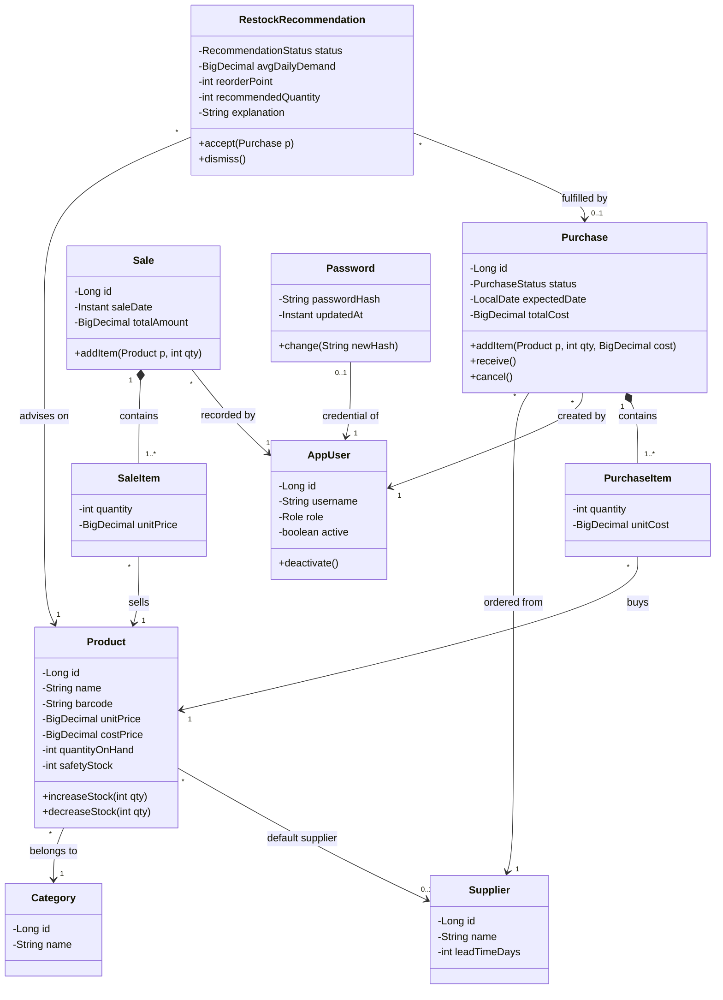
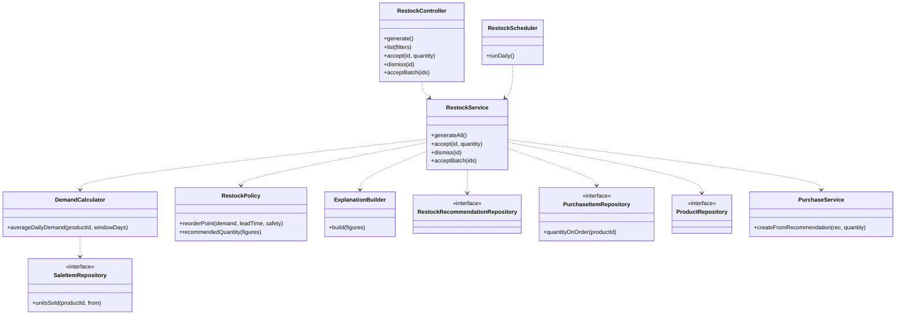

## Diagram 1: Domain entities

```mermaid
classDiagram
  direction TB
  class Supplier {
    -Long id
    -String name
    -int leadTimeDays
  }
  class Category {
    -Long id
    -String name
  }
  class Product {
    -Long id
    -String name
    -String barcode
    -BigDecimal unitPrice
    -BigDecimal costPrice
    -int quantityOnHand
    -int safetyStock
    +increaseStock(int qty)
    +decreaseStock(int qty)
  }
  class Purchase {
    -Long id
    -PurchaseStatus status
    -LocalDate expectedDate
    -BigDecimal totalCost
    +addItem(Product p, int qty, BigDecimal cost)
    +receive()
    +cancel()
  }
  class PurchaseItem {
    -int quantity
    -BigDecimal unitCost
  }
  class Sale {
    -Long id
    -Instant saleDate
    -BigDecimal totalAmount
    +addItem(Product p, int qty)
  }
  class SaleItem {
    -int quantity
    -BigDecimal unitPrice
  }
  class AppUser {
    -Long id
    -String username
    -Role role
    -boolean active
    +deactivate()
  }
  class Password {
    -String passwordHash
    -Instant updatedAt
    +change(String newHash)
  }
  class RestockRecommendation {
    -RecommendationStatus status
    -BigDecimal avgDailyDemand
    -int reorderPoint
    -int recommendedQuantity
    -String explanation
    +accept(Purchase p)
    +dismiss()
  }
  Product "*" --> "1" Category : belongs to
  Product "*" --> "0..1" Supplier : default supplier
  Purchase "*" --> "1" Supplier : ordered from
  Purchase "*" --> "1" AppUser : created by
  Purchase "1" *-- "1..*" PurchaseItem : contains
  PurchaseItem "*" --> "1" Product : buys
  Sale "1" *-- "1..*" SaleItem : contains
  SaleItem "*" --> "1" Product : sells
  Sale "*" --> "1" AppUser : recorded by
  Password "0..1" --> "1" AppUser : credential of
  RestockRecommendation "*" --> "1" Product : advises on
  RestockRecommendation "*" --> "0..1" Purchase : fulfilled by
```

## Diagram 2: Restocking feature classes

```mermaid
classDiagram
  direction TB
  class RestockController {
    +generate()
    +list(filters)
    +accept(id, quantity)
    +dismiss(id)
    +acceptBatch(ids)
  }
  class RestockScheduler {
    +runDaily()
  }
  class RestockService {
    +generateAll()
    +accept(id, quantity)
    +dismiss(id)
    +acceptBatch(ids)
  }
  class DemandCalculator {
    +averageDailyDemand(productId, windowDays)
  }
  class RestockPolicy {
    +reorderPoint(demand, leadTime, safety)
    +recommendedQuantity(figures)
  }
  class ExplanationBuilder {
    +build(figures)
  }
  class RestockRecommendationRepository {
    <<interface>>
  }
  class SaleItemRepository {
    <<interface>>
    +unitsSold(productId, from)
  }
  class PurchaseItemRepository {
    <<interface>>
    +quantityOnOrder(productId)
  }
  class ProductRepository {
    <<interface>>
  }
  class PurchaseService {
    +createFromRecommendation(rec, quantity)
  }
  RestockController ..> RestockService
  RestockScheduler ..> RestockService
  RestockService ..> DemandCalculator
  RestockService ..> RestockPolicy
  RestockService ..> ExplanationBuilder
  RestockService ..> RestockRecommendationRepository
  RestockService ..> ProductRepository
  RestockService ..> PurchaseItemRepository
  RestockService ..> PurchaseService
  DemandCalculator ..> SaleItemRepository
```
